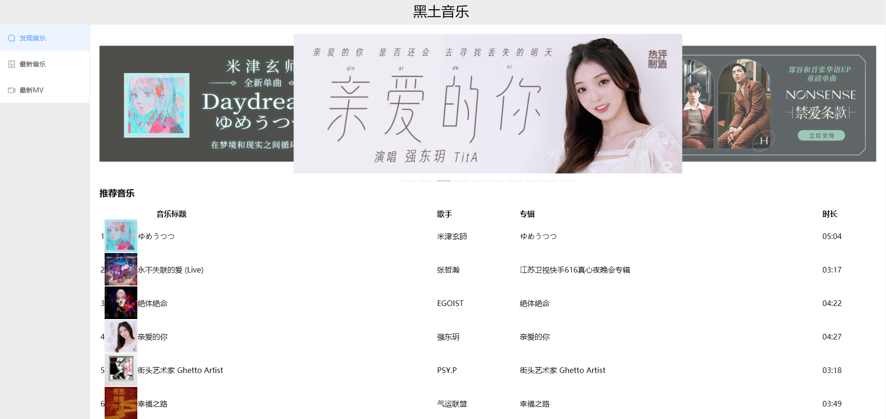

# demo

## Project setup
```
npm install
```

### Compiles and hot-reloads for development
```
npm run serve
```

### Compiles and minifies for production
```
npm run build
```

### Lints and fixes files
```
npm run lint
```

### Customize configuration
See [Configuration Reference](https://cli.vuejs.org/config/).


## 使用技术栈

###### vue2.0 + vue-router  + vuex

axios

moment.js插件

组件模块化

element-ui组件库快速开发


## 项目预览




